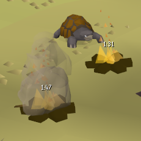
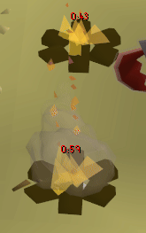
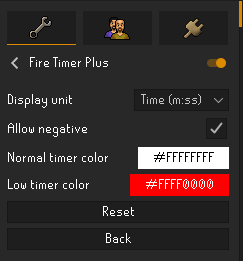

# Fire Timer Plus

A RuneLite plugin that displays a countdown timer over **player-made fires** and **Forester's Campfires** so you know exactly when each will burn out.

## Features

- **Regular fires** — a 200-tick countdown over each fire you light, with a color change when the fire enters its "may burn out at any moment" window. (Same as the original [Fire Timer](https://github.com/autumn-smellegy/fire-timer).)
- **Forester's Campfires** (Forestry update) — tracks campfires you light, infers the per-log burn time, and detects each refuel via the Firemaking XP drop. Countdown updates automatically whether you use "Use log on fire" directly or the chat-dialog flow.
- **Refuel-aware** — adding a log extends the countdown live:

  
- **Display toggle** — show the remaining time as raw game ticks (default) or as `m:ss`. The `m:ss` mode is wall-clock-driven for smooth per-second updates.
- **Allow negative** (optional) — when on, the campfire countdown continues into negative numbers once our estimate runs out. A signal that someone else refueled it.
- **Configurable colors** — pick the normal and low-warning text colors.

## Configuration

| Setting | Default | Description |
|---|---|---|
| Display unit | Ticks | Show timer as raw ticks (e.g. `137`) or `m:ss` (e.g. `1:22`). |
| Allow negative | Off | When on, refuelable-fire countdowns continue past 0 (`-1`, `-2`, …) instead of clamping. |
| Normal timer color | White | Color of the timer while the fire is healthy. |
| Low timer color | Red | Color when the fire is in the burnout window. |

## How it works

Two RuneLite event sources do all the work:

1. **`GameObjectSpawned` / `GameObjectDespawned`** for fires and campfires the plugin should track. Forester's Campfires are re-instantiated by the engine roughly every 99 ticks (a paired despawn + same-tick respawn at the same tile and hash); the plugin buffers despawns for one tick so it can match the respawn and preserve tracking state.
2. **`StatChanged`** for Firemaking XP. Each log burned produces a deterministic XP delta (40 for normal logs, 60 oak, 90 willow, …, 350 redwood). When the local player is adjacent to a Forester's Campfire and a known log XP delta arrives, the plugin extends the countdown by that log's `+ticks_added` value, capped at 300 ticks remaining.

Because detection is XP-based rather than menu-click-based, refuel tracking works for the "Use log on fire" flow, the right-click "Add-log" dialog flow, and rapid auto-repeat alike.

For Forester's Campfires you walk up to (and didn't witness the lighting), the plugin starts in count-up mode until you add a log yourself, at which point it switches to a conservative countdown anchored to your log's contribution.

## Attribution

Fire Timer Plus is adapted from [autumn-smellegy/fire-timer](https://github.com/autumn-smellegy/fire-timer), itself a fork of [alevine/fire-timer](https://github.com/alevine/fire-timer). The original Fire Timer handles regular player-made fires; Fire Timer Plus extends it with Forester's Campfire tracking, log-type-aware countdowns, XP-drop refuel detection, and a configurable display unit.

The original BSD-2-Clause license is preserved in [`LICENSE`](LICENSE).

The plugin icon is derived from the Forester's Campfire image on the [OSRS Wiki](https://oldschool.runescape.wiki/w/Forester%27s_Campfire), used under the wiki's [CC BY-NC-SA 3.0](https://creativecommons.org/licenses/by-nc-sa/3.0/) license.

## License

BSD-2-Clause. See [`LICENSE`](LICENSE).
